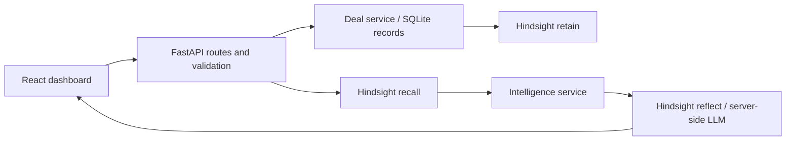

# DealMind - AI Sales Memory & Intelligence Agent

DealMind helps a salesperson recover the requirements, objections and preferences
that get lost across a long deal cycle. Capture a conversation, retain it in
**Hindsight**, recall relevant history, and prepare a sales brief with that evidence.

This repository contains a working local, single-user MVP: FastAPI, SQLite, and a
React dashboard. Three fictional companies and ten dated interactions demonstrate
earlier requirements resurfacing in later negotiations. The frontend calls the
backend; it does not contain fake API responses.

## Architecture



- `backend/main.py`: application factory, lifecycle, CORS and safe memory errors.
- `backend/config.py`, `models.py`, `routes.py`: environment settings, validated
  inputs/responses and HTTP API.
- `backend/database/repository.py`: persistent CRM records, delivery status and
  one-time sample seeding. SQLite is not a replacement for Hindsight memory.
- `backend/memory/hindsight.py`: the only Hindsight SDK adapter. Async SDK calls
  have a timeout, sanitized errors, stable document IDs and a bank per deal.
- `backend/services/deals.py`: retain after saving and retry pending/failed records.
- `backend/services/intelligence.py`: recall first, then reflection with current
  deal context and retrieved evidence; transparent fallback if unavailable.
- `backend/agents/sales.py`: deterministic development brief and evidence-derived
  follow-up checks. These suggestions are labelled as rules-based, even with AI on.
- `frontend/src/App.jsx`: searchable/filterable deal list, details, interaction
  dialog/history, retention state, recall query/results, brief and next actions.
  Loading, error, empty and stale-response states are handled explicitly.
- `frontend/src/api.js`: shared HTTP client. Vite proxies `/api` to FastAPI locally.

## Prerequisites and installation

Use Python 3.11+ and Node.js 22.12+ (Node 22.20 was used for verification).
Run the following from the repository root in PowerShell:

```powershell
python -m venv .venv
.venv\Scripts\python.exe -m pip install -r requirements.txt
Copy-Item .env.example .env
cd frontend
npm ci
cd ..
```

On macOS/Linux use `.venv/bin/python` and `cp .env.example .env` instead.
Do not overwrite an existing `.env`; add missing settings to it. Secrets are ignored
by Git. All customers in `data/sample_deals.json` are fictional.

Start the backend in one terminal, from the repository root:

```powershell
.venv\Scripts\python.exe -m uvicorn backend.main:app --reload --host 127.0.0.1 --port 8000
```

Start the frontend in a second terminal:

```powershell
cd frontend
npm run dev
```

Open [DealMind](http://127.0.0.1:5173) and [interactive API docs](http://127.0.0.1:8000/docs).
The app works without Hindsight credentials for local record management and a
labelled development brief. **Actual retention, recall and AI reflection require
a reachable Hindsight service.**

## Configuration

The backend loads `.env` at the repository root; real environment variables take
precedence. Start from the root so relative database paths resolve consistently.

| Variable | Default | Purpose |
| --- | --- | --- |
| `HINDSIGHT_BASE_URL` | empty | Actual cloud or self-hosted API URL |
| `HINDSIGHT_API_KEY` | empty | Service bearer token, required if your service uses authentication |
| `HINDSIGHT_BANK_PREFIX` | `dealmind` | Bank namespace; letters, digits, `_`, `-` |
| `HINDSIGHT_TIMEOUT` | `60` | Per-SDK-call deadline in seconds, at most 300 |
| `INTELLIGENCE_MODE` | `hindsight` | `hindsight` for reflect; `demo` for deterministic development briefs |
| `DATABASE_PATH` | `data/dealmind.db` | SQLite file; parent directory is created |
| `SEED_SAMPLE_DATA` | `true` | Import fictional sample records once per database |
| `FRONTEND_ORIGIN` | `http://localhost:5173` | Allowed cross-origin frontend URL |
| `VITE_API_URL` | empty | Optional backend origin, set in `frontend/.env.local` |

The default frontend proxy avoids CORS setup and works at `127.0.0.1:5173`.
If using `VITE_API_URL`, set `FRONTEND_ORIGIN` to the exact browser origin (for
example `http://127.0.0.1:5173`). Vite variables are public: never put a secret in
a `VITE_` variable. Restart servers after changing configuration.

### Connect real Hindsight

Use [Hindsight Cloud](https://ui.hindsight.vectorize.io/) or a self-hosted instance
following the [official installation guide](https://hindsight.vectorize.io/developer/installation).
Set its API URL and key in `.env`, restart FastAPI, then select a deal and click
**Sync pending**. Sample records are not silently uploaded on startup.

The adapter uses the official `hindsight-client==0.10.1` Python package, verified
against the [Python SDK docs](https://hindsight.vectorize.io/sdks/python) and installed
method signatures:

1. **RETAIN**: `acreate_bank` and `aretain`, with company/contact context, event
   timestamp, metadata, and interaction ID as `document_id`. `retain_async=False`
   waits for ingestion confirmation before marking the record retained.
2. **RECALL**: `arecall` queries only that deal's bank with `budget="mid"` and a
   bounded token budget. Returned memory IDs and available document IDs appear in
   the UI. No SQLite search is substituted for recalled memories.
3. **USE**: `areflect` receives the current deal, recent interactions and recalled
   evidence as context. The prompt requests evidence-grounded concerns and actions.

The LLM runs within Hindsight. DealMind does not need a separate LLM provider key.
For self-hosting, configure the provider/model/key **on the Hindsight server**
using its [configuration guide](https://hindsight.vectorize.io/developer/configuration).
Cloud manages that service-side configuration. Setting `INTELLIGENCE_MODE=demo`
skips reflection but still attempts genuine recall.

Stable document IDs make retries replace the same interaction document rather
than create independent duplicates. Local status reflects the last confirmed
delivery; it is not continuous verification that a remote bank still exists.
Keep the URL and bank prefix stable for a database. For a separate memory namespace,
use a separate `DATABASE_PATH` as well; there is no remote-bank migration tool.

If Hindsight is unconfigured, times out or rejects a request, an interaction still
saves locally with `memory_status="failed"`. Sync retries oldest first and stops
at the first failure. Recall returns HTTP 503; intelligence returns an explicitly
labelled rules-based brief, with the reason and any successfully recalled evidence.
There is no fake Hindsight mode in the application.

## API

| Method | Endpoint | Result |
| --- | --- | --- |
| GET | `/api/health` | App health, configuration status (not a live Hindsight probe) |
| GET | `/api/deals` | Deals with interaction history |
| POST | `/api/deals` | Create deal; HTTP 201 |
| GET | `/api/deals/{id}` | Deal details; HTTP 404 if missing |
| POST | `/api/deals/{id}/interactions` | Save and attempt retention; HTTP 201 with delivery status |
| POST | `/api/deals/{id}/memory/sync` | Retry pending/failed history; retained/remaining/error fields |
| POST | `/api/deals/{id}/memory/recall` | Recalled evidence; HTTP 503 if unavailable |
| POST | `/api/deals/{id}/intelligence` | AI or labelled development brief with next actions |

Recall and intelligence accept `{"query":"What security requirements are still open?"}`
or `{}` for the default question. Invalid inputs return HTTP 422. Interaction dates
must contain a timezone. Sync may return HTTP 200 with an `error` field for partial
delivery; HTTP 201 on interaction creation means the CRM record saved, not that
memory ingestion succeeded. The UI checks these fields.

Example interaction:

```json
{
  "channel": "Meeting",
  "title": "Security follow-up",
  "content": "Rohan requires a written India-only data residency diagram and SSO validation before the pilot.",
  "occurred_at": "2026-09-29T10:00:00+05:30"
}
```

## Demonstration workflow

1. Select **Aster Health**. The latest call refers to August's unresolved
   requirements without repeating every detail.
2. With Hindsight connected, sync its four sample interactions. Confirm all four
   show **Retained in Hindsight**.
3. Recall: **"What security requirements and communication preferences did Priya
   mention in August?"** Inspect genuine retrieved facts about India-only residency,
   SSO, audit trails and the concise written checklist.
4. Prepare a brief. Compare recalled historical evidence with the current proposal
   and Rohan's upcoming review. Suggestions are not customer commitments.
5. Log the example follow-up and recall again. Restart FastAPI to verify that local
   records persist; the separate Hindsight service keeps long-term memory.
6. Switch to Northstar Logistics or Meridian Retail for independent customer banks.

Without a service, use the same flow to inspect truthful failed-delivery/error
states and rules-based briefs. This does **not** demonstrate successful AI memory.

## Verification

```powershell
.venv\Scripts\python.exe -m pytest -q
.venv\Scripts\python.exe -m pip check
```

In `frontend/`, run `npm test` and `npm run build`. Run `npm run preview` with FastAPI
left running to check the production bundle.

Preview serves the production build at `http://127.0.0.1:4173` and also proxies
`/api`; keep FastAPI running. `dist/` can be hosted elsewhere with an appropriate
API reverse proxy or `VITE_API_URL` supplied at build time.

Backend tests inject async service doubles for deterministic API behavior, plus
exercise the **real SDK over HTTP** against a local contract server. Coverage
includes persistence, seeding, validation, retain/retry, bank isolation, recall,
reflection context, nullable SDK fields, failures and fallback labels. Frontend
tests cover search, saves, failed delivery, stale responses, retry and API errors.
Test fixtures are confined to test files.

An additional real-service smoke test is intentionally opt-in:

```powershell
$env:RUN_LIVE_HINDSIGHT="1"
.venv\Scripts\python.exe -m pytest -m live -s
Remove-Item Env:RUN_LIVE_HINDSIGHT
```

It uses configured credentials, may consume provider credits, and leaves a uniquely
named `smoke-*` deal bank for inspection. It prints the bank name for optional
cleanup in your service. It asserts actual retain, nonempty relevant recall, and
reflection. It is skipped in the default test run.

## Scope and limitations

This is a local single-user demonstration, with no authentication, authorization,
shared-team tenancy, background queue, bulk CRM import or deal editing/deletion.
Keep servers bound to localhost. Before external deployment, add access controls
and deployment-specific security. Banks isolate deal retrieval; they are not an
authorization boundary. Sync processes interactions sequentially and can take
time while Hindsight extracts memories. Customer notes are sent to your configured
Hindsight service when saved or synced.

The hackathon PDFs were treated as background references. Their publishing prompts
do not authorize generating or posting articles, social posts, or videos, and this
implementation does not claim those deliverables are completed.
