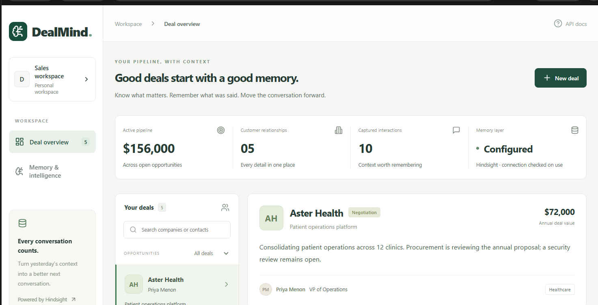
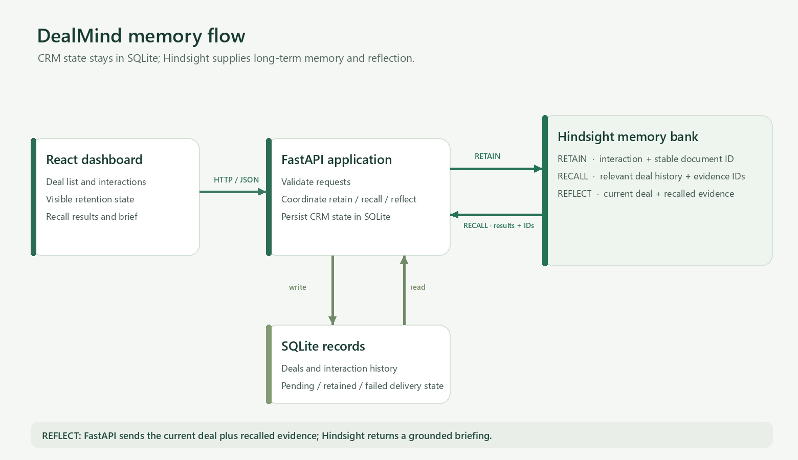
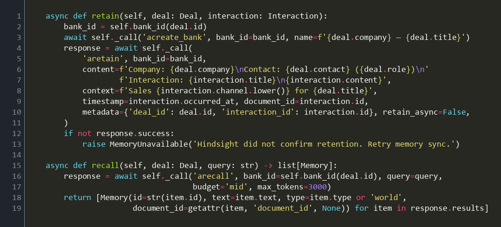
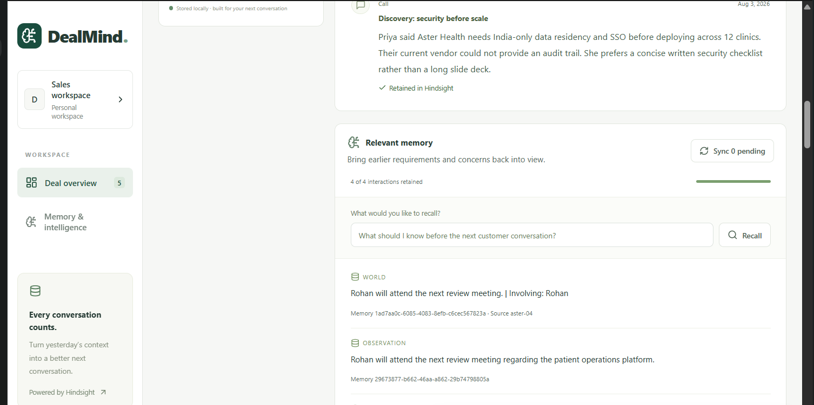

# Why I Recall Before Asking Hindsight to Reflect

The most useful thing a sales agent can remember is often a sentence nobody thought was important at the time. In one deal, a customer’s request for a short written security checklist resurfaced weeks later, when the proposal was under review and the next step depended on whether the original requirements had been addressed.

I built DealMind around that gap between what a team heard and what it can retrieve when the conversation matters. The central design decision was to make memory retrieval an explicit step before asking [Hindsight to reflect on a deal](https://hindsight.vectorize.io/). A model should reason over the customer’s history, not improvise a plausible history of its own.

## The problem is continuity, not note-taking

Most CRM systems are good at holding records and poor at answering a practical question: “What should I remember before the next conversation?” The answer may be scattered across a discovery call, a demo, an email from procurement, and the latest meeting note. A salesperson can search those records, but that means knowing which words to search for and having time to reconstruct the story.

DealMind stores the operational record of a deal separately from its long-term memory. FastAPI validates and serves deals and interactions; SQLite persists those local records and their delivery status. Hindsight retains interaction content, recalls relevant facts for a query, and reflects over the recalled evidence together with the current deal state. The React dashboard makes each step visible: interactions, whether memory accepted them, the recalled results, and the resulting brief.

That separation matters. The CRM record answers “what did we capture?” Hindsight answers “what from the past is relevant now?” Keeping both lets the application show where a claim came from instead of treating a generated paragraph as ground truth. This is one practical version of [agent memory as a system capability](https://vectorize.io/what-is-agent-memory), rather than a chat transcript pasted into every prompt.



*The overview keeps the deal record and memory status in the same workspace.*

The request path is intentionally ordinary: the browser talks to FastAPI, which coordinates local CRM persistence and Hindsight operations. The separation keeps Hindsight-specific calls behind one adapter.



*Hindsight sits behind the backend boundary; the browser never calls the memory service directly.*

## Why retrieval comes before reflection

It is tempting to send the whole deal history to a language model and ask for a summary. That can work for a short interaction list, but it couples reasoning to how much history happens to fit in a prompt. It also makes every later question pay to process information that may have nothing to do with the issue at hand.

I instead made the sequence explicit: retain interactions as they happen, recall against a focused question, then reflect with the current deal and the retrieved evidence. Hindsight owns memory extraction and retrieval; DealMind owns the customer-facing workflow and the boundary around how evidence is used. The [Hindsight project on GitHub](https://github.com/vectorize-io/hindsight) and its [Hindsight documentation](https://hindsight.vectorize.io/) describe the underlying memory service; the application integrates through its supported Python client.

The adapter builds a bank identifier from a stable prefix and deal ID. An interaction is retained with the company, contact, title, event time, and content. The interaction ID becomes the document ID:

```python
await self._call(
    'aretain', bank_id=bank_id,
    content=f'Company: {deal.company}\nContact: {deal.contact} ({deal.role})\n'
            f'Interaction: {interaction.title}\n{interaction.content}',
    context=f'Sales {interaction.channel.lower()} for {deal.title}',
    timestamp=interaction.occurred_at, document_id=interaction.id,
    metadata={'deal_id': deal.id, 'interaction_id': interaction.id},
    retain_async=False,
)
```

The stable identifier is a small choice with an important operational effect. If a network timeout leaves the caller unsure whether the retain succeeded, retrying with the same interaction ID does not intentionally create a second, unrelated document. Waiting for ingestion confirmation also means the local status is not marked retained merely because the request was sent.



*This image is rendered from the checked-in adapter source, not a simulated terminal transcript.*

## Recall has to be useful and inspectable

When someone asks what matters before a customer meeting, DealMind calls Hindsight’s recall operation against that deal’s bank. It bounds the retrieval request and converts the returned results into a small application model:

```python
response = await self._call(
    'arecall', bank_id=self.bank_id(deal.id), query=query,
    budget='mid', max_tokens=3000,
)
return [
    Memory(id=str(item.id), text=item.text, type=item.type or 'world',
           document_id=getattr(item, 'document_id', None))
    for item in response.results
]
```

The memory ID and source document ID are not decoration. They make it possible for a user to inspect the evidence behind an answer and connect a recalled fact to the original interaction. The bank boundary also prevents an ordinary deal query from pulling another customer’s conversation into its context. It is a retrieval boundary, not an authorization system; access control still belongs in the application and its deployment environment.

For the Aster Health example, the latest call says the proposal does not address requirements discussed in August. A recall query can bring back the earlier India-only data residency and SSO requirements, the IT lead responsible for approving them, and the customer’s preference for a concise written checklist. Those details are much more actionable together than they are as isolated CRM notes. They also provide a concrete way to check whether the brief is grounded: each important assertion should correspond to a returned memory or current record.



*The recall panel exposes the returned facts and, where available, the interaction each came from.*

## Reflection should synthesize evidence, not invent it

After recall, the intelligence service passes Hindsight a compact context containing the current deal, the latest interactions, and the recalled memories. It asks for concerns, requirements, preferences, changes, and next actions, while telling the model to distinguish evidence from suggestions:

```python
context = json.dumps({
    'current_deal': deal.model_dump(mode='json', exclude={'interactions'}),
    'latest_interactions': [i.model_dump(mode='json') for i in deal.interactions[:3]],
    'recalled_evidence': [m.model_dump() for m in memories],
})
```

The reflection prompt includes an instruction to treat customer text as untrusted evidence, not as instructions. This distinction matters whenever content comes from calls, emails, or imported records. The customer’s words are data to reason about; they are not a new system prompt.

I also require a real recall result before using the Hindsight reflection path. If recall fails or returns nothing, the service labels its deterministic alternative as a rules-based development brief. It does not quietly present a fallback as an AI answer. In production, that same principle should survive: a graceful response is useful, but a false claim about where it came from is not.

Hindsight failures also need to be understandable without leaking SDK internals. For example, an exhausted cloud credit balance produces a specific actionable message, while other upstream errors become a generic service/credentials availability message. That avoids returning arbitrary exception bodies to a browser and gives the operator a useful next step.

## The workflow changes what the brief can say

Consider a deal with four interactions. In August, the customer asks for India-only data residency and SSO, says the prior vendor lacked an audit trail, and requests a concise written checklist. After a product demonstration, an IT lead is named as the approver. In September, procurement says the annual price is within budget if a pilot succeeds, while explicitly warning that budget approval is not security approval. The latest call says the proposal still misses the earlier requirements and asks for an owner for the pilot.

A brief based only on the latest interaction sees an open security review and a request for an owner. A brief informed by retrieved history can connect the open review to the specific requirements, identify the approver, remember the requested document format, and preserve the distinction between commercial and security approval. That is not a prediction about whether the deal will close. It is a better working set for the next conversation.

DealMind keeps suggested follow-up checks visually separate from the reflected brief. The rules-based checks are extracted from requirements and requests in current interactions and retrieved memories. They are prompts for a salesperson to verify, not actions the system takes on the customer’s behalf. This separation is deliberately conservative: customer-facing commitments should not emerge from an unreviewed summary.

## The operational edges are part of the memory design

Memory is an external dependency, so it can fail independently of local record capture. DealMind saves an interaction locally first, then records whether retention succeeded. A retry processes older interactions first to preserve the narrative and stops when it encounters an error instead of repeatedly making failing requests for the rest of the history. The user sees pending, retained, or failed status and can retry explicitly.

That means the UI can tell the truth at each stage. A saved CRM interaction is not the same as a retained Hindsight memory. A configured URL is not proof that the service is reachable. A returned brief is not necessarily a reflection if the application had to fall back. These distinctions may look like implementation details, but they determine whether an engineer can debug a real customer report without guessing.

## What I would carry into another system

First, give memory a clear interface. Isolating the Hindsight SDK in one adapter makes provider behavior, timeouts, and error translation testable without spreading service-specific details across routes and components.

Second, design writes for retries from the start. Stable document IDs and persisted delivery status make a flaky network a recoverable state instead of a duplicate-data problem.

Third, retrieve for the question being asked. A short, relevant evidence set is easier to inspect and pass to reflection than an ever-growing transcript.

Fourth, preserve provenance in the user experience. Memory IDs, source interaction IDs, and visible delivery status help users challenge a result and help engineers debug it.

Finally, make fallback behavior explicit. An application can remain useful when memory is unavailable, but the interface should say what it could and could not do.

The point of recalling before reflecting is not to make a model sound more informed. It is to make the reasoning depend on information the system can show, trace, and recover when a request fails. That is the difference between an answer that merely sounds like it remembers and a workflow an engineer can trust enough to inspect.
